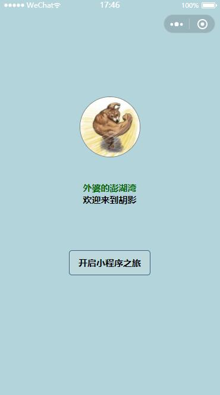
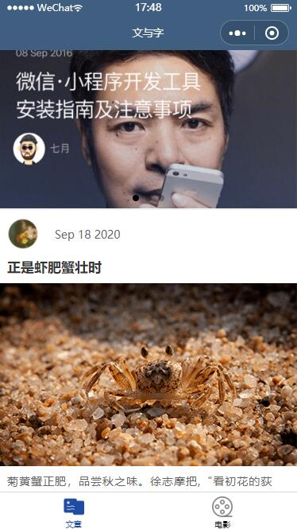
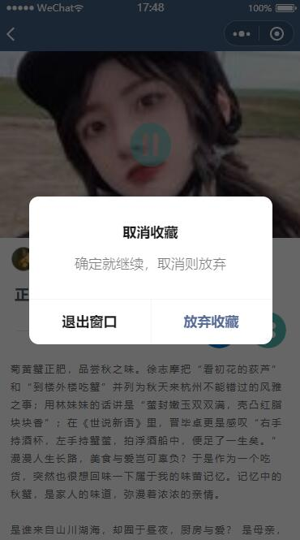
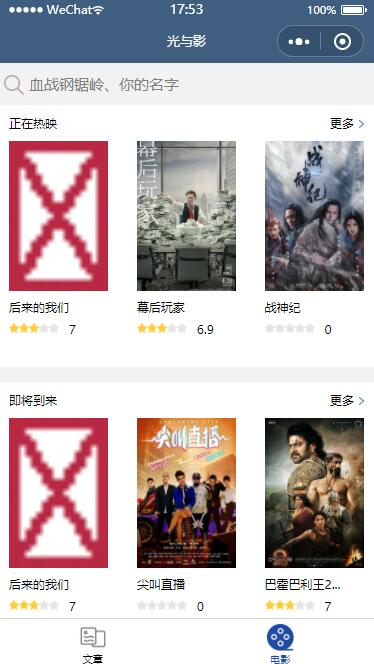
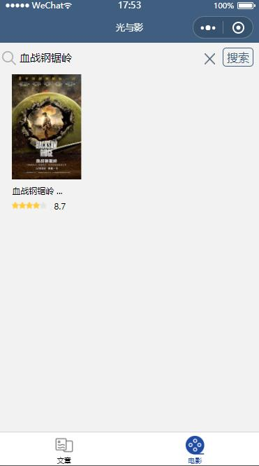
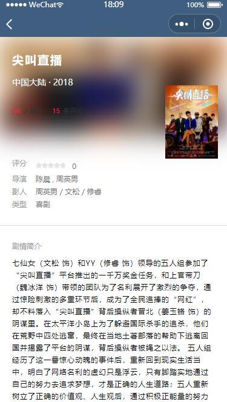

# ReaderMovie
 微信小程序
# 在微信开发工具里导入项目可以运行
# 项目介绍
-  使用了组件嵌套、swiper组件、背景音乐播放、缓存、路由传参、组件通信 
- app.json设置了 tabBar用于页面底部显示导航栏————文章和电影 
- welcome部分获取用户登录信息显示了用户微信头像和用户昵称。 

- post部分展示了文章简介、阅读数量和收藏数量(用的是本地数据加缓存数量模拟点击后阅读人数增加)、文章详情 

- 进入文章详情post-detail音乐会在后台播放，返回页面也还是可以播放，播放按钮切换音乐暂停时背景图片切换。 

- movie 部分发出请求从服务器得到返回数据显示较少的 正在热映、即将到来、热门电影的标题和海报，电影搜索功能，还做了图片出错时本地图片替换默认图片的功能，点击单个电影的数据会进入该电影的详情页，通过元素携带的id完善新的请求 

- movie-more部分进入后先向服务器请求20条数据，展示在页面中，然后上滑到底时触发onReachBottom事件，发出得到再加20条数据的请求，更新在data里，页面渲染增加的数据，下拉到底时触发onPullDownRefresh事件，发起和进入页面一样的请求，达到网络不稳定时加载失败时刷新页面的需求。 

- movie-detail部分 携带在image元素上的id属性用于完整发送电影详情的请求得到电影数据，然后图片上添加了catch:tap事件，写了wx.previewImage用于详细查看海报图片。
